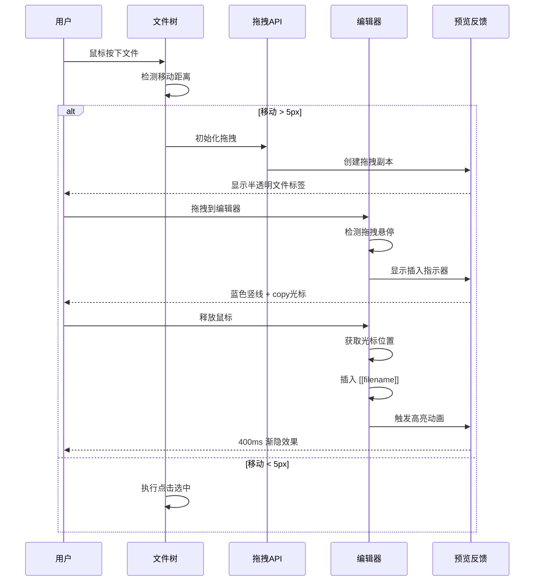
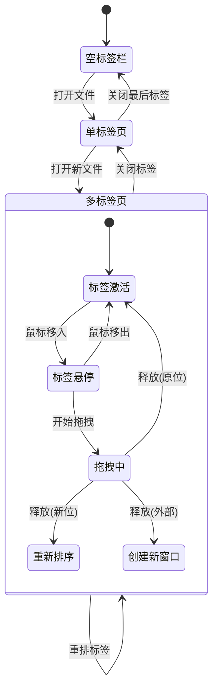
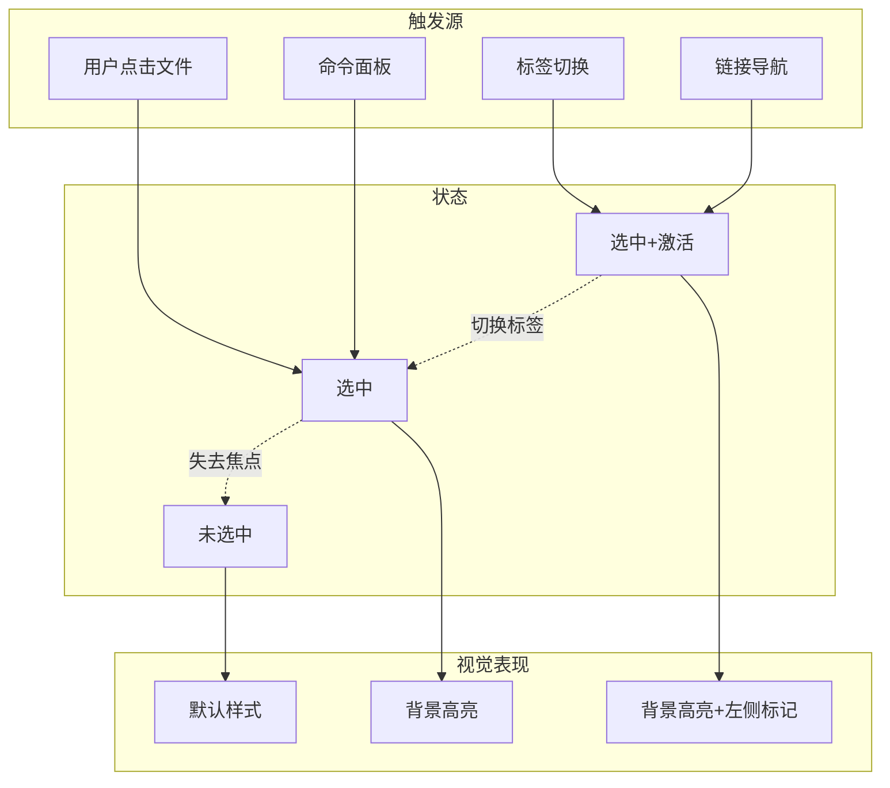
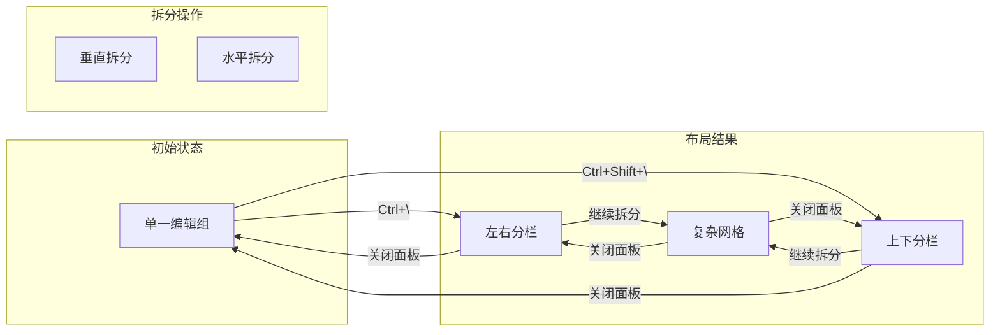
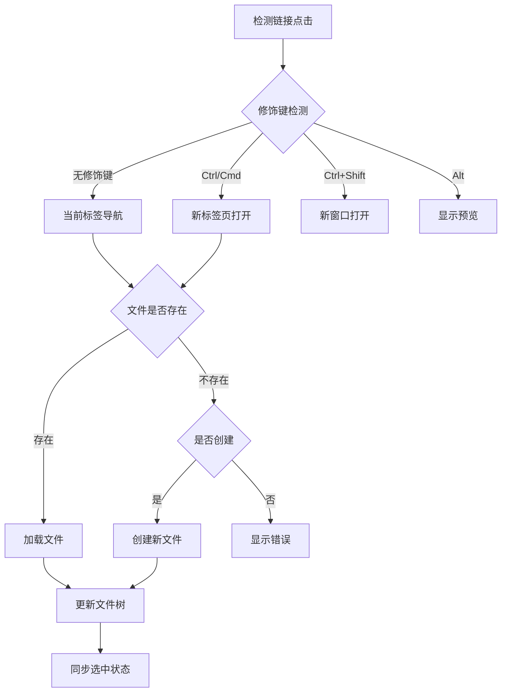
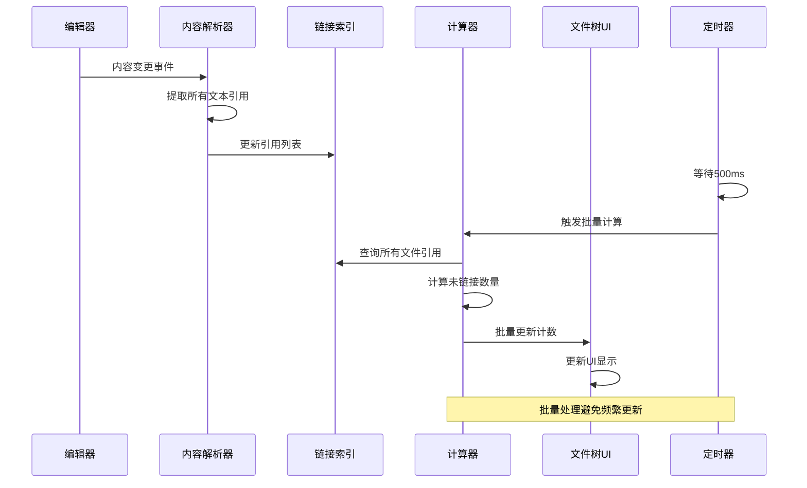
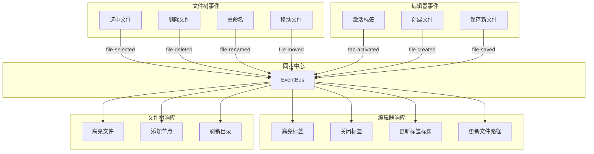
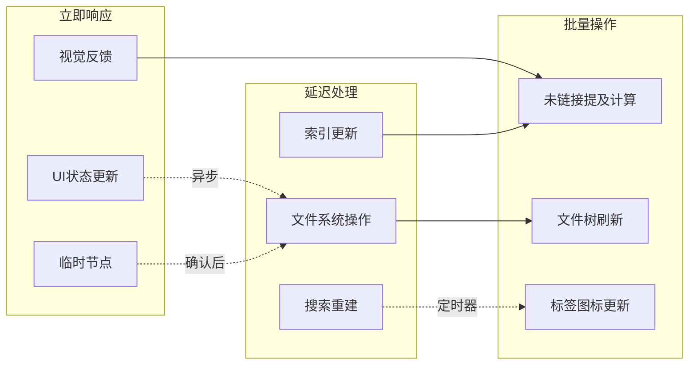
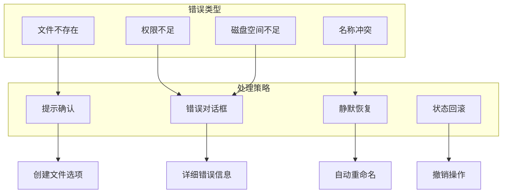

# Obsidian 交互流程与状态转换图

## 1. 拖拽生成链接 - 详细交互流程



## 2. 多标签页导航 - 状态机



## 3. 文件树选中状态 - 状态转换



## 4. 编辑组(Pane)系统 - 布局状态



## 5. 链接点击行为 - 决策树



## 6. 未链接提及 - 数据流时序



## 7. 文件树与编辑器 - 完整状态同步



## 8. 拖拽标签 - 多场景处理

```mermaid
stateDiagram-v2
    [*] --> 开始拖拽
    
    开始拖拽 --> 拖拽中
    
    拖拽中 --> 检测释放位置
    
    检测释放位置 --> 同组重排: 标签栏内
    检测释放位置 --> 跨组移动: 其他编辑组
    检测释放位置 --> 创建窗口: 编辑器外
    检测释放位置 --> 取消操作: ESC键
    
    同组重排 --> 更新标签顺序
    跨组移动 --> 移动标签数据
    创建窗口 --> 生成新窗口
    取消操作 --> [*]
    
    更新标签顺序 --> [*]
    移动标签数据 --> 更新组焦点 --> [*]
    生成新窗口 --> [*]
```

## 9. 性能优化策略



## 10. 错误处理流程

