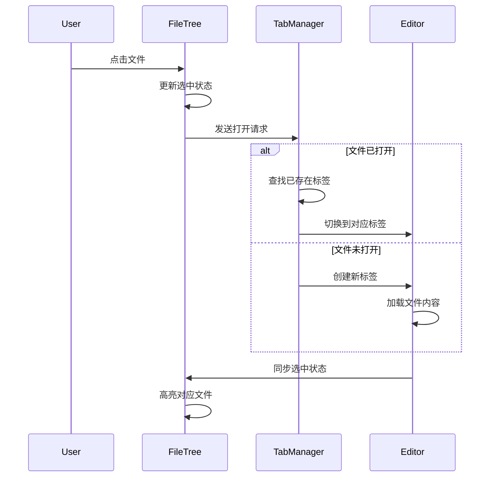
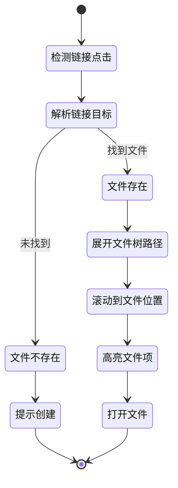
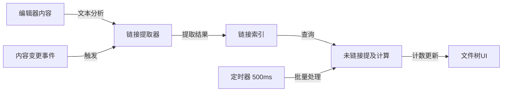
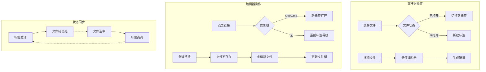

# Obsidian UI/UX 深度分析：文件树与多标签编辑器设计规范

## 执行摘要

本文档深度分析了Obsidian软件中"文件树"（File Explorer）和"多标签编辑器"（Tabbed Editor）两个核心组件的设计哲学、交互逻辑和视觉规范。重点探讨了两者之间独特的双向交互关系，以及它们如何共同构建一个支持非线性思维和网络化知识管理的工作环境。

---

## 第一部分：组件深度分析

### 1. 文件树 (File Explorer)

#### 1.1 UX/交互分析

##### 核心交互流程

**文件/文件夹创建**
- 触发方式：右键菜单 → "New note" / "New folder"
- 交互细节：
  - 创建时立即进入编辑模式，光标自动聚焦
  - 支持 `Esc` 取消，`Enter` 确认
  - 动效：淡入效果（200ms），高亮背景渐变提示新建状态

**重命名流程**
- 触发：`F2` 键或右键菜单
- 状态变化：
  1. 文件名变为可编辑输入框
  2. 全选文件名（不含扩展名）
  3. 边框高亮显示（2px solid accent-color）
- 验证：实时检查重名，显示警告提示

**拖拽移动**
- 拖拽启动阈值：鼠标按下后移动 5px
- 视觉反馈：
  - 拖拽中：半透明克隆元素（opacity: 0.7）
  - 目标文件夹：高亮显示（背景色加深）
  - 插入指示器：2px 蓝色横线显示插入位置

**删除操作**
- 触发：`Delete` 键或右键菜单
- 安全机制：弹出确认对话框
- 软删除：移至 `.trash` 文件夹（可恢复）

##### 独特功能：拖拽生成链接

**交互细节**
1. **拖拽启动**
   - 光标变化：从默认箭头变为 `grab` 手型
   - 拖拽对象：显示文件名的半透明浮动标签

2. **悬停编辑器**
   - 光标变化：显示 `copy` 图标（加号）
   - 编辑器响应：插入点显示蓝色竖线光标

3. **释放后反馈**
   - 即时插入：`[[filename]]` 格式的内部链接
   - 动效：链接文本短暂高亮（400ms 渐隐）
   - 音效：轻微的确认音（可选）

##### 未链接提及（Unlinked Mentions）

**显示逻辑**
- 位置：文件名右侧，灰色小字体数字
- 更新时机：
  - 实时扫描：编辑器内容变化时
  - 批量更新：每 500ms 批量处理
- UX价值：
  - 发现隐含连接
  - 引导用户建立显式链接
  - 增强知识网络密度感知

##### 导航行为

**文件夹交互**
- 单击：展开/收缩（动画时长 150ms）
- 双击：展开并跳转到第一个子文件
- 展开状态持久化：记忆用户偏好

**文件交互**
- 单击：
  - 已打开：切换到对应标签页
  - 未打开：在当前活跃编辑组新建标签
- `Ctrl/Cmd + 单击`：始终新建标签
- `Ctrl/Cmd + Shift + 单击`：在新编辑组中打开

#### 1.2 UI/视觉分析

##### 布局规范

```
文件树结构
├─ 根目录缩进: 8px
├─ 每级缩进: 16px
├─ 行高: 24px
├─ 文件图标: 16x16px
├─ 图标与文字间距: 6px
└─ 右侧边距: 12px
```

##### 视觉样式

**字体规范**
- 字体族：`-apple-system, BlinkMacSystemFont, "Segoe UI", Roboto`
- 字号：13px（文件名）, 11px（徽章）
- 字重：400（默认）, 500（选中）

**颜色方案**
```css
/* 浅色主题 */
--file-default: #2e3338;
--file-hover: #000000;
--file-selected: #7f6df2;
--folder-icon: #8b8b8b;
--background-hover: rgba(0,0,0,0.05);
--background-selected: rgba(127,109,242,0.1);

/* 深色主题 */
--file-default: #dcddde;
--file-hover: #ffffff;
--file-selected: #7f6df2;
--folder-icon: #999999;
--background-hover: rgba(255,255,255,0.08);
--background-selected: rgba(127,109,242,0.2);
```

##### 图标设计

**设计风格**：极简线性图标（stroke-width: 1.5px）

**图标类型**
- 📁 文件夹（关闭）：简约文件夹轮廓
- 📂 文件夹（打开）：文件夹开口状态
- 📄 Markdown文件：带 `M↓` 标识
- 🖼️ 图片文件：山景轮廓图标
- 📎 附件：回形针图标

##### 状态设计

**四态视觉规范**

1. **默认状态**
   - 背景：透明
   - 文字：`--file-default`
   - 图标：`--folder-icon`

2. **悬停状态**
   - 背景：`--background-hover`
   - 文字：`--file-hover`
   - 过渡：`all 150ms ease`

3. **选中状态**（对应活跃标签）
   - 背景：`--background-selected`
   - 文字：`--file-selected`
   - 左侧标记：3px 宽的强调色竖条

4. **拖动状态**
   - 原位置：50% 透明度
   - 拖动副本：带阴影的浮动元素

### 2. 多标签编辑器 (Tabbed Editor)

#### 2.1 UX/交互分析

##### 标签管理

**打开新标签**
- 触发方式：
  - 点击文件
  - `Ctrl/Cmd + N`（新建无标题笔记）
  - 点击链接时按住 `Ctrl/Cmd`
- 位置逻辑：在当前标签右侧插入

**关闭标签**
- 方式：
  - 点击 `×` 按钮
  - 中键点击标签
  - `Ctrl/Cmd + W`
- 未保存提示：修改标记（圆点）+ 确认对话框

**标签切换**
- 鼠标点击：直接切换
- 键盘导航：
  - `Ctrl/Cmd + Tab`：循环切换
  - `Ctrl/Cmd + Shift + Tab`：反向循环
  - `Ctrl/Cmd + 1-9`：跳转到第N个标签

**拖拽重组**
- 标签内重排：拖动时显示插入指示线
- 创建新窗口：拖出标签栏区域
- 合并到其他组：拖到目标编辑组的标签栏

##### 导航逻辑：链接点击行为

**设计决策分析**
- 默认行为：当前标签页导航
- `Ctrl/Cmd + 点击`：新标签页打开
- 设计优势：
  1. 保留上下文：不丢失当前阅读位置
  2. 并行探索：支持多线索同时追踪
  3. 减少认知负荷：用户控制导航方式

##### 编辑组（Pane）系统

**创建拆分**
- 垂直拆分：`Ctrl/Cmd + \`
- 水平拆分：`Ctrl/Cmd + Shift + \`
- 右键菜单：更多拆分选项

**编辑组特性**
- 独立标签栈：每组维护自己的标签集合
- 独立历史：前进/后退导航独立
- 焦点指示：活跃组显示强调色边框

**标签组间移动**
- 拖拽：直接拖到目标组标签栏
- 命令：`Move to pane` 命令面板选项
- 快捷操作：`Ctrl/Cmd + Shift + 方向键`

#### 2.2 UI/视觉分析

##### 标签栏样式

**尺寸规范**
```css
.tab {
  height: 36px;
  min-width: 100px;
  max-width: 200px;
  border-radius: 6px 6px 0 0;
  padding: 0 30px 0 12px; /* 为关闭按钮预留空间 */
}

.tab-bar {
  background: var(--background-secondary);
  border-bottom: 1px solid var(--background-modifier-border);
}
```

**颜色状态**
```css
/* 激活标签 */
.tab.active {
  background: var(--background-primary);
  color: var(--text-normal);
  box-shadow: 0 1px 0 var(--background-primary);
}

/* 非激活标签 */
.tab:not(.active) {
  background: transparent;
  color: var(--text-muted);
}

/* 悬停状态 */
.tab:not(.active):hover {
  background: var(--background-modifier-hover);
  color: var(--text-normal);
}
```

##### 标签内容

**元素组成**
1. 图标（可选）：16x16px，如 📌（固定标签）
2. 标题：省略号截断，悬停显示完整
3. 修改指示器：8px 圆点，未保存时显示
4. 关闭按钮：
   - 尺寸：16x16px
   - 显示逻辑：始终显示（活跃）/ 悬停显示（非活跃）

##### 编辑区域

**Markdown编辑器样式**
```css
.markdown-editor {
  font-family: 'Inter', -apple-system, sans-serif;
  font-size: 15px;
  line-height: 1.6;
  color: var(--text-normal);
  background: var(--background-primary);
  padding: 40px 60px;
}

/* 代码块 */
.code-block {
  font-family: 'JetBrains Mono', 'Fira Code', monospace;
  font-size: 13px;
  line-height: 1.4;
  background: var(--code-background);
  border-radius: 6px;
  padding: 16px;
}
```

---

## 第二部分：核心双向关系分析

### 从文件树到编辑器

#### 路径 A：直接打开文件



#### 路径 B：拖拽创建链接

**数据交换过程**

1. **拖拽数据封装**
```javascript
dragData = {
  type: 'file-explorer-drag',
  filePath: '/path/to/file.md',
  fileName: 'file',
  fileType: 'markdown'
}
```

2. **Drop事件处理**
```javascript
onDrop(event) {
  const data = JSON.parse(event.dataTransfer.getData('application/obsidian'));
  const linkText = `[[${data.fileName}]]`;
  editor.insertAtCursor(linkText);
}
```

3. **视觉反馈时序**
   - T+0ms: 开始拖拽，创建拖拽副本
   - T+100ms: 进入编辑器，显示插入指示器
   - T+200ms: 释放，插入链接
   - T+200-600ms: 链接高亮渐隐动画

#### 状态同步机制

**双向绑定实现**

```javascript
// 文件树 → 编辑器
FileTree.on('select', (file) => {
  EventBus.emit('file-selected', file);
  Editor.highlightTab(file.path);
});

// 编辑器 → 文件树
Editor.on('tab-activated', (tab) => {
  EventBus.emit('tab-activated', tab);
  FileTree.highlightFile(tab.filePath);
});
```

### 从编辑器到文件树

#### 导航反馈

**链接点击流程**



#### 内容生成影响结构

**实时更新机制**

1. **文件创建监听**
```javascript
Editor.on('create-file-from-link', (fileName) => {
  FileSystem.createFile(fileName);
  FileTree.addNode(fileName, { animate: true });
});
```

2. **更新延迟策略**
   - 立即更新：UI层面的临时节点
   - 延迟确认：500ms后与文件系统同步
   - 冲突处理：重名检测与自动重命名

#### 反向链接数据流



### 共同状态管理

#### 多编辑组场景

**焦点同步策略**

```javascript
class FocusManager {
  constructor() {
    this.activePaneId = null;
    this.paneTabMap = new Map();
  }
  
  onPaneFocus(paneId) {
    this.activePaneId = paneId;
    const activeTab = this.paneTabMap.get(paneId);
    FileTree.setActiveFile(activeTab?.filePath);
  }
  
  onTabSwitch(paneId, tabId) {
    if (paneId === this.activePaneId) {
      const tab = this.getTab(paneId, tabId);
      FileTree.setActiveFile(tab.filePath);
    }
  }
}
```

---

## 交互流程图

### 主要交互流程



---

## 设计规范摘要

### 关键度量

| 类别 | 属性 | 数值 |
|------|------|------|
| **间距** | 文件树缩进 | 16px/级 |
| | 文件树行高 | 24px |
| | 标签高度 | 36px |
| | 编辑器内边距 | 40px 60px |
| **字体** | UI字体 | -apple-system, "Segoe UI" |
| | 编辑器字体 | Inter, 15px/1.6 |
| | 代码字体 | JetBrains Mono, 13px/1.4 |
| **颜色** | 主题色 | #7f6df2 |
| | 文本主色 | #2e3338 (浅) / #dcddde (深) |
| | 背景主色 | #ffffff (浅) / #202020 (深) |
| **动画** | 过渡时长 | 150-200ms |
| | 缓动函数 | ease / ease-out |
| **交互** | 拖拽阈值 | 5px |
| | 更新延迟 | 500ms（批量） |

---

## 设计哲学总结

Obsidian的文件树与多标签编辑器设计体现了"**认知工具的透明性**"理念。通过以下核心原则实现：

1. **空间记忆优先**：文件的物理位置（文件树）与逻辑位置（标签）始终保持视觉关联，利用用户的空间记忆能力。

2. **非模态交互**：避免模态对话框，所有操作都是可逆的、非阻塞的，让用户保持思维流畅性。

3. **渐进式披露**：基础功能（点击打开）简单直观，高级功能（拖拽链接、多面板）通过修饰键和手势逐步呈现。

4. **双向数据流**：文件树和编辑器不是主从关系，而是平等的信息入口，任一侧的操作都会实时反映到另一侧。

5. **最小惊讶原则**：交互行为符合桌面应用惯例（如Ctrl+点击新标签），降低学习成本。

这套设计将复杂的知识网络管理任务转化为直观的空间操作，真正实现了"工具退居幕后，思维占据前台"的设计目标。